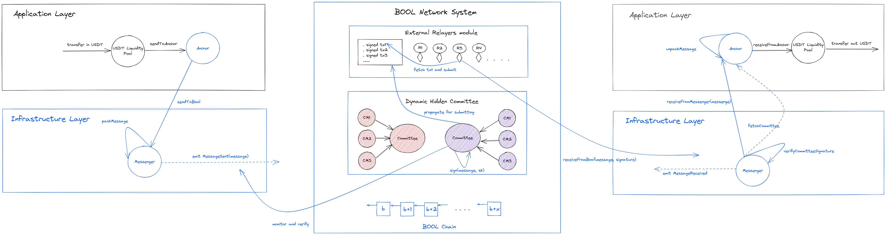
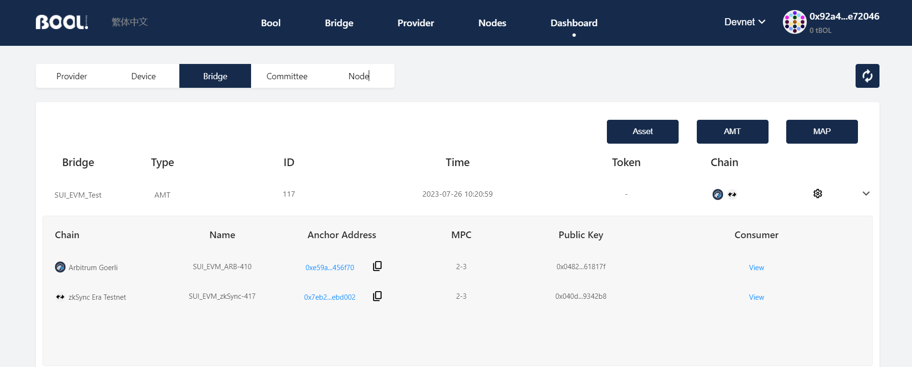

<div align="center">
    
</div>

---

# Bool Network Advanced Solidity Examples
Advanced Solidity examples for developing on Bool Network.
## Installation
-   Clone this repository
    ```sh
    git clone https://github.com/boolnetwork/advanced-solidity-tutorials.git
    cd advanced-solidity-tutorials
    ```
- Add dependencies
    ```sh
    yarn install
    ```

<p align="right">(<a href="#readme-top">back to top</a>)</p>

## Project structure

- `/contracts`: smart contracts.
- `/tasks`: extra Hardhat tasks to build omni-chain applications on Bool Network.
- `hardhat.config.ts`: configuration file.
<!-- - `/deploy`: deployment and contract interaction scripts.
- `/test`: test files -->

<p align="right">(<a href="#readme-top">back to top</a>)</p>

## Environment variables
In order to prevent users to leak private keys, this project includes the dotenv package which is used to load environment variables. It's used to load the wallet private key, required to run the deploy script.

To use it, rename `.env.example` to `.env` and enter your private key. And do remember to fund your `DEPLOYER_ADDRESS` in order to build!

```
TESTNET_DEPLOYER_PRIVATE_KEY=123cde574ccff....
TESTNET_DEPLOYER_ADDRESS=0x123cde574ccff....
```

In addition, set the RPC URLs of the networks you want to test with.

```
ETHEREUM_GOERLI_RPC_URL = 
ZKSYNC_GOERLI_RPC_URL = 
OPTIMISM_GOERLI_RPC_URL = 
ARBITRUM_GOERLI_RPC_URL = 
```

<p align="right">(<a href="#readme-top">back to top</a>)</p>

## Commands

- `yarn hardhat compile` will compile the contracts.
- `yarn hardhat compile --network zksync_goerli` will specifically compile the contracts for the zkSync Goerli network.

<p align="right">(<a href="#readme-top">back to top</a>)</p>

# Build an AMT Bridge

## About AMT Bridge

### What is an AMT Bridge?
Arbitrary Message Transmission (AMT) bridges are a type of bridge defined by Bool Network that allows for the transfer of arbitrary data across multiple chains. This is in contrast to a token bridge, which only allows for the transfer of a specific token. 

Each AMT bridge is defined by a group of `Anchor` contracts, one on each chain. Each `Anchor` contract is responsible for helping its uniquely binding `Consumer` contract to interact with Bool Network by sending and receiving cross-chain messages.

The security of each `Anchor` is preserved by a distinctive [Dynamic Hidden Committee](https://boolnetwork.gitbook.io/docs/concepts/dynamic-hidden-committee-dhc) in Bool Network.

### How does an AMT Bridge work?

<div align="center">
    
</div>

## Build an AMT Bridge

In this section, we provide an outline for developers to build an Arbitrary Message Transmission (AMT) bridge on Bool Network.

> WARNING: **You must build an AMT bridge before deploying an omni-chain application on Bool Network.**

1. Open [Bool Network Explorer (Testnet)](https://boolscan.com/dashboard/committee?network=testnet).
2. Connect your MetaMask to Bool Network Testnet ([configuration here](https://boolnetwork.gitbook.io/docs/evm-ecosystem/amt-bridges/network-configuration)).
3. Create two `ECDSA`-type committees, one for each chain ([link here](https://boolnetwork.gitbook.io/docs/evm-ecosystem/amt-bridges/create-committees)).
4. Build an AMT bridge by deploying two `Anchor` contracts to two chains respectively ([link here](https://boolnetwork.gitbook.io/docs/evm-ecosystem/amt-bridges/build-a-bridge)).
5. You should see your newly created AMT bridge under the `Dashboard/Bridge` tab ([link here](https://boolscan.com/dashboard/bridge?network=testnet)). An example is given as follows: 

<div align="center">
    
</div>

<p align="right">(<a href="#readme-top">back to top</a>)</p>


# TokenBridge

## About TokenBridge

> WARNING: **TokenBridge is designed for testing purposes only.**

This section provides an outline for deploying a burn & mint ERC20 token bridge on Bool Network.

## Deploy Setup
Deploy an AMT Bridge ([Build an AMT Bridge](#build-an-amt-bridge)) and get two `Anchor` addresses through `BoolScan/Dashboard/Bridge/<your bridge>`. For example:
- `0xe59a9ab6a5732d5f7a89d9c7f31964c459456f70` on Arbitrum Goerli
- `0x7eb25a4ab45e29c9306a1987c664111bf7ebd002` on zkSync Goerli

## TokenBridge.sol - a burn & mint ERC20 token bridge

> WARNING: **You must deploy an AMT bridge through BoolScan before building a TokenBridge.**
1. Deploy two TokenBridge contracts.
    ```angular2html
    Format: yarn hardhat deployTokenBridge --anchor <anchor address> --decimals <decimals> --name <token name> --symbol <token symbol> --network <network name>
    ```
    ```angular2html
    yarn hardhat deployTokenBridge --anchor 0xe59a9ab6a5732d5f7a89d9c7f31964c459456f70 --decimals 9 --name BoolTestToken --symbol BTT --network arbitrum_goerli

    Output:
    Deploying TokenBridge...
    Deploying a new TokenBridge contract on chain 421613...
    TokenBridge deployed at 0x565D09b0cd1c8B7Ca4846c06cc9Ec4a92a01012d
    ```
    ```angular2html
    yarn hardhat deployTokenBridge --anchor 
    0x7eb25a4ab45e29c9306a1987c664111bf7ebd002 --decimals 9 --name BoolTestToken --symbol BTT --network zksync_goerli

    Output:
    Deploying TokenBridge...
    Deploying a new TokenBridge contract on chain 280...
    TokenBridge deployed at 0x281b5702012654065733A0b763e2F3494663968b
    ```
2. Binding each TokenBridge to an Anchor.
    ```angular2html
    Format: yarn hardhat updateConsumer --anchor <anchor address> --consumer <tokenBridge address> --network <network name>
    ```
    ```angular2html
    yarn hardhat updateConsumer --anchor 0xe59a9ab6a5732d5f7a89d9c7f31964c459456f70 --consumer 0x565D09b0cd1c8B7Ca4846c06cc9Ec4a92a01012d --network arbitrum_goerli

    Output:
    The current consumer: 0x0000000000000000000000000000000000000000
    Updating the consumer...
    Transaction hash: 0x9bb73e827f490d7863bb23696ee55c8f0ce9395a64c1b67edc1b7fb1127446a5
    The new consumer: 0x565D09b0cd1c8B7Ca4846c06cc9Ec4a92a01012d
    ```
    ```angular2html
    yarn hardhat updateConsumer --anchor 0x7eb25a4ab45e29c9306a1987c664111bf7ebd002 --consumer 0x281b5702012654065733A0b763e2F3494663968b --network zksync_goerli

    Output:
    The current consumer: 0x0000000000000000000000000000000000000000
    Updating the consumer...
    Transaction hash: 0x139d4589783d96a36d7a40748a7e090e844feb131b007850a4a3ed9ca06bb673
    The new consumer: 0x281b5702012654065733A0b763e2F3494663968bb
    ```
3. Configure the "remote anchors" so each of them can receive messages from one another, and `only` one another on a specific chain.
    ```angular2html
    Format: yarn hardhat updateRemoteAnchor --anchor <anchor address> --id <remote chain id> --remoteanchor <remote anchor address in bytes32> --network <network name>
    ```
    ```angular2html
    yarn hardhat updateRemoteAnchor --anchor 0xe59a9ab6a5732d5f7a89d9c7f31964c459456f70 --id 280 --remoteanchor 0x0000000000000000000000007eb25a4ab45e29c9306a1987c664111bf7ebd002 --network arbitrum_goerli

    Output:
    Updating the remote anchors...
    Transaction hash: 0x3ef9850d957763db1eb9a0fc3526ba6a70f67e64b547a7569e87102314629854
    ```
    ```angular2html
    yarn hardhat updateRemoteAnchor --anchor 0x7eb25a4ab45e29c9306a1987c664111bf7ebd002 --id 421613 --remoteanchor 0x000000000000000000000000e59a9ab6a5732d5f7a89d9c7f31964c459456f70 --network zksync_goerli

    Output:
    Updating the remote anchors...
    Transaction hash: 0x46660f869763dedb4a3697cb08fbb51b666bef6204e3c7eabd2c66481ae34e56
    ```
4. Deposit tokens on Arbitrum Goerli and receive them on zkSync Goerli.
    ```angular2html
    Format: yarn hardhat tokenBridgeDeposit --amount <deposit amount> --bridge <tokenBridge address> --id <destination chain id> --network <network name>
    ```
    ```angular2html
    yarn hardhat tokenBridgeDeposit --amount 1000000000 --bridge 0x565D09b0cd1c8B7Ca4846c06cc9Ec4a92a01012d --id 280 --network arbitrum_goerli

    Output:
    Depositing 1.0 BTT to chain 280
    Transaction hash: 0x4de93d3f6ae3d301e0ceffbee3e87203db98aa8017e2f66321f547d4431a5d32
    ```
5. Track the lifecycle of the transaction on [BoolScan](https://boolscan.com/bridge/amt/?network=testnet).


<p align="right">(<a href="#readme-top">back to top</a>)</p>

## Official Links

- [Website](https://bool.network/)
- [Documentation](https://boolnetwork.gitbook.io/docs/)
- [GitHub](https://github.com/boolnetwork)
- [Twitter](https://twitter.com/Bool_Official)

<p align="right">(<a href="#readme-top">back to top</a>)</p>
